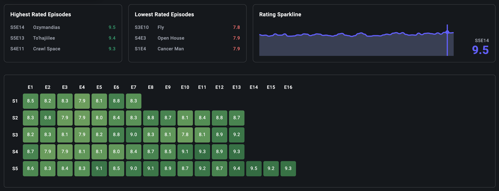

# TV Explorer

This application is a full-stack TV discovery and tracking platform built in Nuxt, providing features including: advanced search/filtering, detailed show pages, personalized favorites and watchlists, and interactive data visualizations of show rating metrics.

<details>
  <summary>Table of Contents</summary>
  <ol>
    <li><a href="#tv-explorer">TV Explorer</a></li>
    <li><a href="#live-demo">Live Demo</a></li>
    <li><a href="#screenshots">Screenshots</a></li>
    <li><a href="#about-the-project">About the Project</a></li>
    <li><a href="#features">Features</a></li>
    <li><a href="#built-with">Built With</a></li>
    <li>
      <a href="#getting-started">Getting Started</a>
      <ul>
        <li><a href="#prerequisites">Prerequisites</a></li>
        <li><a href="#installation">Installation</a></li>
      </ul>
    </li>
    <li><a href="#license">License</a></li>
    <li><a href="#author">Author</a></li>
  </ol>
</details>

## Live Demo

https://tv-explorer.vercel.app

## Screenshots

<div align="center">
  
  
</div>

<div align="center">
  
  
</div>

<p align="right">(<a href="#readme-top">back to top</a>)</p>

## About The Project

This project originated from a personal passion for television and a desire to gain in-depth insights into TV shows and discover my next bingewatch. I found that existing platforms tend to focus on movies, and that there are a lack of platforms specifically dedicated to television - this project felt suitable to address both my personal needs and that market gap. In addition to solving that, this project enabled me to expand my tech stack by learning new frameworks in Vue.js and Nuxt.js.

<p align="right">(<a href="#readme-top">back to top</a>)</p>

### Built With

* [![Nuxt][Nuxt.js]][Nuxt-url]
* [![Vue][Vue.js]][Vue-url]
* [![Tailwind][TailwindCSS]][TailwindCSS-url]
* [![Redis][Redis]][Redis-url]
* [![MongoDB][MongoDB]][MongoDB-url]

<p align="right">(<a href="#readme-top">back to top</a>)</p>

## Installation

- Install dependencies:

```bash
npm install

pnpm install

yarn install

bun install
```

## Development Server

- Start the development server on `http://localhost:3000`:

```bash

npm run dev

pnpm dev

yarn dev

bun run dev
```

## Getting Started

This is an example of how you may give instructions on setting up your project locally.
To get a local copy up and running follow these simple example steps.

### Prerequisites

This is an example of how to list things you need to use the software and how to install them.
* npm
  ```sh
  npm install npm@latest -g
  ```

### Installation

1. Get a free API Key at [https://example.com](https://example.com)
2. Clone the repo
   ```sh
   git clone https://github.com/vrydberg/tv-explorer.git
   ```
3. Install NPM packages
   ```sh
   npm install
   ```
4. Enter your API in `config.js`
   ```js
   const API_KEY = 'ENTER YOUR API';
   ```
5. Change git remote url to avoid accidental pushes to base project
   ```sh
   git remote set-url origin vrydberg/tv-explorer
   git remote -v # confirm the changes
   ```

<p align="right">(<a href="#readme-top">back to top</a>)</p>


## License

MIT License

<p align="right">(<a href="#readme-top">back to top</a>)</p>

## Contact

Project Link: [https://github.com/vrydberg/tv-explorer](https://github.com/vrydberg/tv-explorer)

<p align="right">(<a href="#readme-top">back to top</a>)</p>

[Nuxt.js]: https://img.shields.io/badge/Nuxt-002E3B?logo=nuxt&logoColor=#00DC82
[Nuxt-url]: https://nuxt.com/

[Vue.js]: https://img.shields.io/badge/Vue.js-4FC08D?logo=vuedotjs&logoColor=fff
[Vue-url]: https://vuejs.org/

[Vercel]:https://img.shields.io/badge/Vercel-%23000000.svg?logo=vercel&logoColor=white
[Vercel-url]:https://vercel.com/

[Redis]:https://img.shields.io/badge/Redis-%23DD0031.svg?logo=redis&logoColor=white
[Redis-url]:https://redis.io/

[TailwindCSS]:https://img.shields.io/badge/Tailwind%20CSS-%2338B2AC.svg?logo=tailwind-css&logoColor=white
[TailwindCSS-url]:https://tailwindcss.com/

[MongoDB]:https://img.shields.io/badge/MongoDB-%234ea94b.svg?logo=mongodb&logoColor=white
[MongoDB-url]:https://www.mongodb.com/