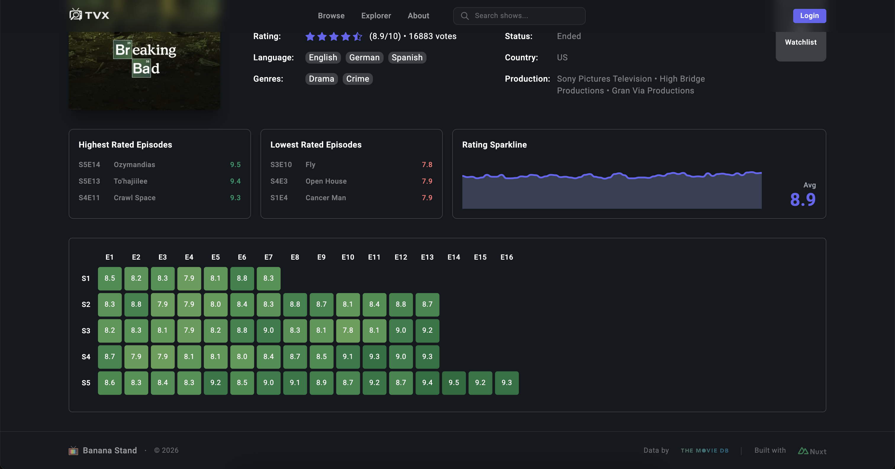
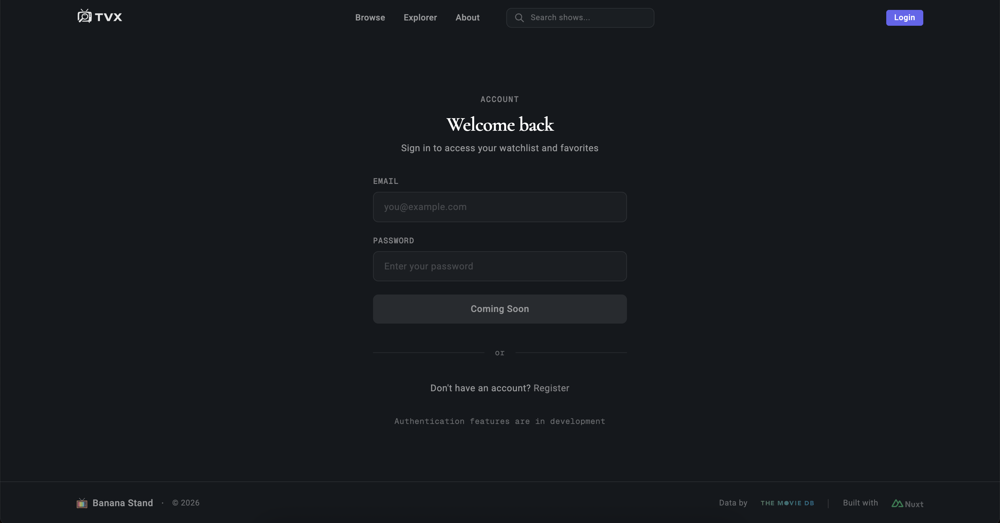

<div align="center">

# TV Explorer

A full-stack TV discovery platform with advanced filtering, interactive D3.js visualizations, and server-side caching.

[](https://tv-explorer.vercel.app)
[](LICENSE)

**[View Live Demo](https://tv-explorer.vercel.app)**

</div>

## Screenshots

<div align="center">
  
  
</div>

<div align="center">
  
  
</div>

<div align="center">
  
  
</div>

## Features

- **Advanced Search & Filtering** — Multi-parameter filtering by genre, language, release date, ratings, and runtime
- **Interactive Data Visualizations** — D3.js-powered rating heatmaps and sparkline charts for episode-level insights
- **Server-Side API Proxy** — Secure TMDB API integration with protected credentials
- **Redis Caching Layer** — Upstash Redis with intelligent cache key generation and TTL management
- **Rate Limiting** — Sliding window rate limiting (10 req/10s) to prevent API abuse

## Tech Stack

| Category | Technology |
|----------|------------|
| Framework | Nuxt 4 (Vue 3, Nitro) |
| Styling | Tailwind CSS 4 |
| Data Visualization | D3.js v7 |
| Caching | Upstash Redis |
| Rate Limiting | @upstash/ratelimit |
| External API | TMDB API v3 |
| Deployment | Vercel |

## Architecture Highlights

```
├── app/
│   ├── pages/           # File-based routing (landing, explorer, show details)
│   ├── components/      # Vue components (auto-imported)
│   └── utils/           # Client-side utilities
├── server/
│   ├── api/tmdb/        # Proxy endpoints with caching
│   ├── middleware/      # Rate limiting, cache timing
│   └── utils/           # Server utilities
```

**Key Implementation Decisions:**

- **Server-side data fetching** — All TMDB API calls route through Nitro server endpoints to protect API keys and enable caching
- **Two-layer caching** — `defineCachedEventHandler` with Upstash Redis storage; 30-min TTL for search, 24-hr TTL for show details
- **Smart cache key generation** — Deterministic keys from sorted/sanitized filter parameters for complex queries
- **Parallel data fetching** — `Promise.allSettled` for fetching all season data concurrently

## Getting Started

### Prerequisites

- Node.js >= 18
- [TMDB API Key](https://www.themoviedb.org/documentation/api)
- [Upstash Redis](https://upstash.com/) account

### Installation

```bash
# Clone the repository
git clone https://github.com/username/tv-explorer.git
cd tv-explorer

# Install dependencies
npm install

# Configure environment variables
cp .env.example .env
```

Add your credentials to `.env`:

```
NUXT_TMDB_API_KEY=your_tmdb_bearer_token
UPSTASH_REDIS_REST_URL=your_upstash_url
UPSTASH_REDIS_REST_TOKEN=your_upstash_token
```

### Development

```bash
npm run dev        # Start dev server at http://localhost:3000
npm run build      # Production build
npm run preview    # Preview production build
```

## License

This project is licensed under the MIT License.

---

<div align="center">

[![Nuxt][Nuxt.js]][Nuxt-url]
[![Vue][Vue.js]][Vue-url]
[![Tailwind][TailwindCSS]][TailwindCSS-url]
[![Redis][Redis]][Redis-url]
[![Vercel][Vercel]][Vercel-url]

</div>

[Nuxt.js]: https://img.shields.io/badge/Nuxt-002E3B?logo=nuxt&logoColor=#00DC82
[Nuxt-url]: https://nuxt.com/
[Vue.js]: https://img.shields.io/badge/Vue.js-4FC08D?logo=vuedotjs&logoColor=fff
[Vue-url]: https://vuejs.org/
[TailwindCSS]: https://img.shields.io/badge/Tailwind%20CSS-%2338B2AC.svg?logo=tailwind-css&logoColor=white
[TailwindCSS-url]: https://tailwindcss.com/
[Redis]: https://img.shields.io/badge/Redis-%23DD0031.svg?logo=redis&logoColor=white
[Redis-url]: https://redis.io/
[Vercel]: https://img.shields.io/badge/Vercel-%23000000.svg?logo=vercel&logoColor=white
[Vercel-url]: https://vercel.com/